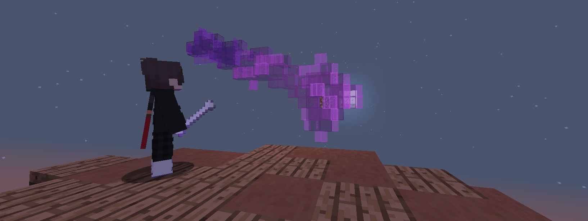
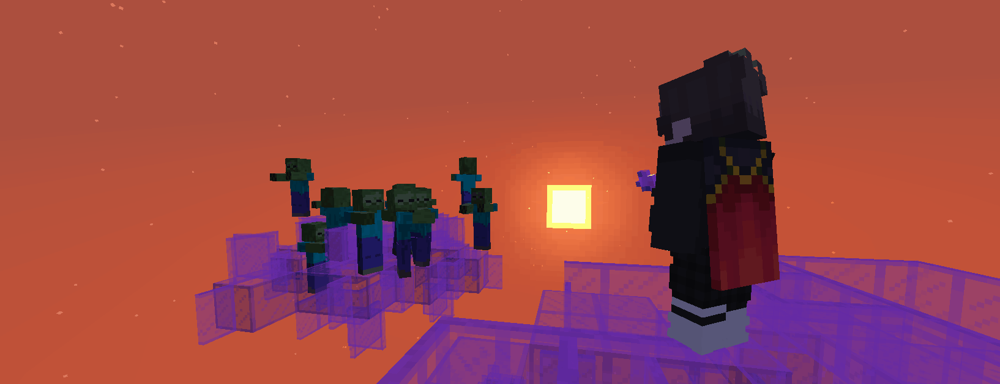

# Boomerang
Boomerang is a highly-configurable Minecraft Spigot plugin <b>(1.8.*)</b>, designed to give players a unique approach at enemy encounters with bone-y boomerangs.

If you encounter any problems, [create a GitHub issue](https://github.com/ka-rar/boomerang/issues/new).

## Commands
* `/boomerang <player> [amount]` (`boomerang.give`): Acquire a boomerang!

## Configuration
```yaml
# config
damage-mob: true
damage-villager: false
damage-player: false

animation:
  throw:
    damage: 20
    rotate-speed: 60 # (int) per tick
    radius: 1 # (double) blocks
    duration: 20 # (int) ticks
  return:
    damage: 20
    rotate-speed: 60
    radius: 1
    duration: 20
  catch:
    # t: prioritize catch on radius from player / f: rely on duration
    proximity: true
    radius: 0.1

# https://hub.spigotmc.org/javadocs/bukkit/org/bukkit/Material.html
# https://hub.spigotmc.org/javadocs/bukkit/org/bukkit/enchantments/Enchantment.html
BOOMERANG:
  material: BONE
  type: 0
  name: '&6Boomerang'
  lore:
    - '&7Forged by the &cmightiest'
    - '&7calcium deposits in the lands.'
    - ''
    - '&eClick to throw!'
  enchantments:
    - 'DURABILITY:1'
  flags:
    - 'HIDE_ENCHANTS'
  unique: true

SEDENTARY_BOOMERANG:
  material: GHAST_TEAR
  type: 0
  name: '&6Boomerang'
  lore:
    - '&7Forged by the &cmightiest'
    - '&7calcium deposits in the lands.'
  enchantments:
    - 'DURABILITY:1'
  flags:
    - 'HIDE_ENCHANTS'
  unique: true
```

## Messages
```yaml
# messages
no-permission: '&cYou do not have permission to perform this command.'
invalid-syntax: '&cUsage: /boomerang <player> [amount]'
successful: '&eGave &d{amount}&e boomerang{s} to &d{player}&e.'
failed-offline: '&cThe player {player} is not online.'
failed-invalid-amount: '&cThe amount {amount} is not a valid number.'
failed-negative-amount: '&cThe amount {amount} is not positive.'
failed-inventory-full: '&cThe player {player} has a full inventory.'
```

## Installation
To get the jar, either download it from the releases tab here on [GitHub](https://github.com/ka-rar/boomerang/releases) or [build it](https://github.com/ka-rar/boomerang#build).

## Build
[Git](https://git-scm.com/downloads) and Maven (`brew install maven`) are required to clone and build this project. Navigate to a new directory and run:
```cmd
git clone https://github.com/ka-rar/boomerang
cd boomerang
mvn clean package
```
Output jar will be located at `target/Boomerang.jar`.

## Screenshots


